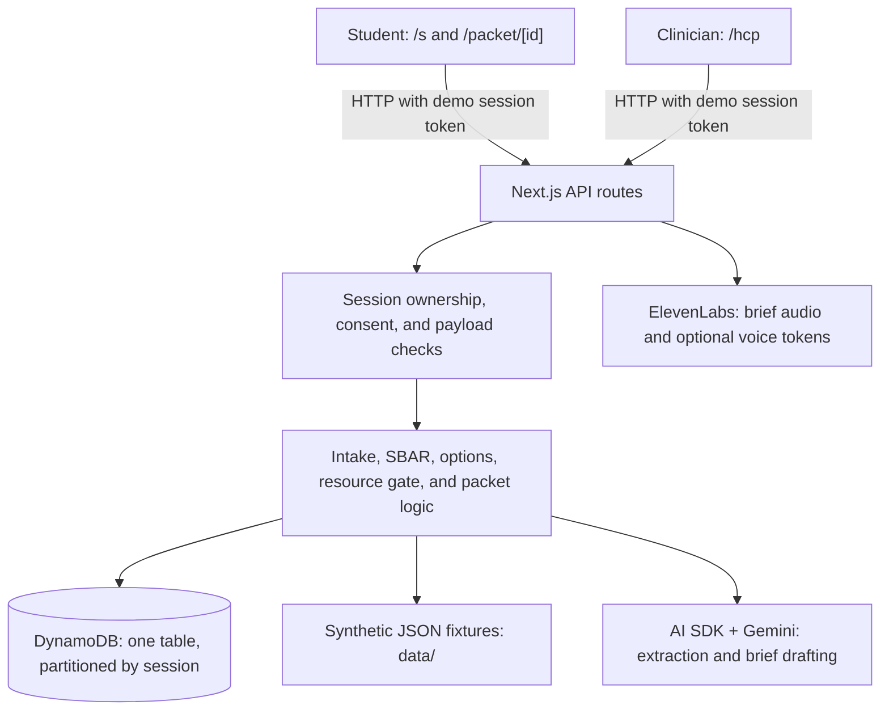

# Sick Day + Doorway

[sickway.health](https://sickway.health/)

**Feeling sick is hard. Explaining it in another language should not be.**

A synthetic prototype about one barrier: a student who is sick, and less comfortable in English, may know exactly how they feel and still struggle to find the words, follow healthcare terms, or tell whether the clinic understood. The workflow is student intake, a clinician brief, and a returned patient packet, and every step exists to help the student say it and check it. The product scope and demo scenario are in [sickway.md](sickway.md); the language work is recorded in [docs/language-access.md](docs/language-access.md).

Prototype workflow. Not medical advice. Do not enter real health information.

## The problem, what this shows, and what it does not

- **The problem.** Unequal access to understandable healthcare communication because of language. It is a communication gap, not a gap in intelligence or in knowing one's own body; the student is the authority on their experience.
- **What the prototype demonstrates.** Optional plain-language prompts in English and Spanish that help a student say what feels wrong, when it started, and what they want understood (read-only guidance: a prompt never becomes an answer). A review the student controls, with their original words above the extracted details. The same words, unchanged, beside the clinician's brief. Prewritten packet instructions in the language the student chose.
- **The intended benefit, not measured.** Fewer students staying silent because of language. There are no patients, no user research, and no outcome data here, and none is claimed.
- **The limit that matters most.** Interface text is localized; **what a student types is never translated**. In the recorded Spanish walkthrough the English brief read “reports fiebre and me duele todo el cuerpo”. A clinician who does not read Spanish is not helped by that, and the screen says so beside the student's words: helping someone organize a concern does not establish that a language mismatch has been resolved. Runtime translation and interpreter services are out of scope.

## Who it is for

Two fictional users: a sick **student**, and a college-health **clinician**. Students who are **not native English speakers** are an explicit target audience: the whole student journey — entry and pairing, intake, review, consent, status, and the returned packet — is available in **English and Español**, in plain language, with unfamiliar healthcare and demo terms explained where they appear. English/Spanish is the first supported pair, not a claim to serve every language, and none of it is validated translation. Details, rules, a walkthrough for each language, and open wording questions: [docs/language-access.md](docs/language-access.md).

## What it does

One synthetic scenario, end to end, on two paired devices: **intake → clinician brief → options → packet**.

1. **Student (`/s`, phone).** Sees the synthetic profile and where each field comes from, types what is wrong, answers three follow-up groups, reviews and corrects every field, confirms the onset, and gives separate explicit consent. Declining keeps everything on the phone.
2. **Clinician (`/hcp`, laptop).** The shared intake appears in the queue on its own. The clinician reads a traceable SBAR brief (with audio and the source values beside it), asks for the mock options, opens one named therapy's manufacturer resources if they choose to, selects an option, reviews a confirmation, and attaches a packet.
3. **Student again.** “Your demo packet is ready” appears without a refresh and links to `/packet/<id>`.

**Reset demo** in the header starts a clean run. Nothing is booked, prescribed, verified, or sent anywhere.

## Tech stack

| Layer | Technologies | Role |
| --- | --- | --- |
| Runtime and tooling | Node.js 24, pnpm 10.3.0, TypeScript 5 | Local development, dependency management, and shared types |
| Application | Next.js 16 App Router, React 19, Vercel | One application serving pages and server API routes |
| UI | Tailwind CSS v4, shadcn/ui, Radix UI, Lucide, Motion | Styling, accessible UI primitives, icons, and animation; vendored MagicUI and RareUI components |
| Validation | Zod 4 | Runtime validation of configuration, API payloads, stored records, and generated output |
| AI | AI SDK 7, Google Gemini (`@ai-sdk/google`) | Structured intake extraction and clinician SBAR drafting |
| Persistence | Amazon DynamoDB, AWS SDK v3 | One table for sessions, encounters, packets, resource audit events, and generation cache |
| Audio and voice | ElevenLabs, `@elevenlabs/react` | Brief text-to-speech; optional live clinician voice and student dictation |
| Quality checks | ESLint 9, Vitest, Testing Library, jsdom, Playwright Core | Static checks, unit/component/API tests, and scripted browser layout checks |

Exact dependency versions and commands live in [package.json](package.json). The student experience uses prewritten English and Spanish copy, with no runtime translation.

## Design

The look comes from the logo (`public/brand/sickway-logo.png`, redrawn as SVG in `src/components/brand/sickway-logo.tsx`): cream paper, black ink, and one red line.

- **Colour** (`src/app/globals.css`, sampled from the logo): paper `#fdf9e8`, ink `#000`, brand red `#ee121d`. The logo red is 4.1:1 on paper, so it is used for line art and large type only; `--brand-red-ink` `#c8121b` (5.6:1) carries red text and white-on-red buttons.
- **Type:** Archivo 900 italic for display (`.display`, every `h1`), echoing the wordmark; Figtree for body, chosen for open letterforms that stay legible for tired and second-language readers.
- **Glass:** cards, the navbar, and the phone tab bar are translucent panels (`.glass`, `.glass-strong`) over a fixed, gradient-tinted backdrop (`.page-backdrop`). The fill is opaque enough to keep contrast where `backdrop-filter` is unavailable; gradients rather than blur filters keep it cheap on phones.
- **Navigation:** a floating glass pill inside one sticky frame with the required synthetic-data banner, so both stay in view while scrolling. Below 768 px the pill keeps the logo and the language choice, and the destinations move to a glass tab bar at the bottom, clear of the iOS home indicator (`viewport-fit=cover` + safe-area insets). Only one nav is mounted at a time.
- **Dashed means mock.** Every `secondary` badge — mock cost, mock coverage, fictional pharmacy, prepared output, simulated self-report — has a dashed outline; solid chips are real system state. The landing page states this rule and every screen keeps it.
- **One red line.** The logo's stroke is the progress thread in the student stepper and slides between steps in the landing page's scroll story. The clinician brief uses large S / B / A / R letters; the returned packet (`/packet/[id]`) is a paper ticket: a stub with the title and the mock price, a perforated tear line with side notches, scalloped edges top and bottom, and a shadow that follows that outline (`.ticket`, `.ticket-top`, `.ticket-bottom` in `globals.css`).
- **Motion** is decoration, never information: reveals on the landing page only, `MotionConfig reducedMotion="user"`, and a global `prefers-reduced-motion` rule.
- **MagicUI** components (vendored in `src/components/ui/`): `blur-fade`, `border-beam`, `dot-pattern`, `iphone`, `safari`. The device frames show **real screenshots of this app**: run `pnpm shots:brand` (with `pnpm dev` running) to regenerate `public/brand/shot-*.png` after a UI change. The phone frame (`src/components/ui/iphone.tsx`) is a transparent PNG of an iPhone 17 Pro Max, `public/brand/iphone-frame.png`, drawn over the screenshot; it was cut from a team-supplied mockup whose checkerboard background was painted in, and the screen rectangle in the component was measured from it. The phone shots reserve the iOS safe area, so the frame's Dynamic Island has room. One deliberate difference from the live app: the phone previews hide the synthetic-data banner's text (`scripts/brand-shots.mjs`), because the landing page around them carries the banner itself. The app on a real phone shows it on every screen. The required synthetic-data banner is on every screen at every width: a black bar from 640px up, and on a phone a slim frosted strip in the page's cream (`src/components/synthetic-banner.tsx`), with the browser's theme colour matched to it. The hero shows its two devices as a slideshow (`src/components/landing/device-slideshow.tsx`): the clinician's laptop first, then the student's phone, changed with arrow buttons or a swipe. It never advances on its own, the stage keeps one height for both slides, and the position dots are decoration so every control is a full-size touch target. On wide screens the hero's device column grows into the right margin (`.hero-bleed` in `globals.css`), which is what lets the laptop and phone be large. The hero is at least one window tall (`min-h-[calc(100svh-10rem)]`), so the next section only appears on scroll, and its text slides left into the empty margin (`.hero-shift`, which stops short of the side rail) to open white space before the devices. No testimonials, ratings, or usage numbers are shown, because there are none.
- **Pinned story.** From 1024px the "Follow one sick day" section pins: the heading, the three steps, and the device stage hold still while the page scrolls, the scroll position moves the story from step 1 to 3 (70vh of scrolling each), and only after step 3 does the section let go. Scroll position is the single source of truth; the player and the clickable step titles only scroll the page. The steps list fills the height left under the heading and each step takes a third of it, so the 1-2-3 line runs the full height and the titles hold still while the current description opens. The device panel is full height too (up to 50rem), and the pinned block grows into the right margin (`--bleed`, as the hero does), which widens the panel without shortening the text's lines. The current step expands with CSS grid rows (`0fr` to `1fr`), never a measured height: animating to `height: "auto"` makes Motion restore the scroll position, which cancels a smooth scroll in flight. Below 1024px the steps are a plain list, each with its own screenshot.
- **Demo menu.** Starting a session and pairing the second device live behind a **Demo** button in the navbar (`src/components/session/demo-menu.tsx`), not in the landing page. Its panel opens on hover, and also on click and keyboard focus, because hover alone cannot be used on a touch screen or a keyboard; Escape or a click outside closes it. Below 1024px the same panel is a bottom sheet. Beside "Copy link", "Show QR code" draws the join link as a QR code for a phone's camera (`qrcode.react`, in the browser: the link carries the session token, so it is never sent to an outside QR service). On `localhost` the panel says the code cannot work, because a phone cannot open that address. The hero keeps one row of actions: "Start demo session" (which starts one and opens the menu on the join link), then the two screens and "Pair a second device".
- **App screens.** The clinician workspace is the page, not a box on it: on a wide screen it takes the margins too (`.page-bleed`), the queue is a sticky glass rail, and each section is its own glass panel with a display heading. The options layout follows the width of its own column, not the window (`useElementWidth`): a seven-column table from 900px of room, otherwise cards, two across when they fit. On the student screen the made-up patient opens as one line with the rest under "Details", so "What is going on today?" is on the first screen of a phone.
- **RareUI** components (MIT, vendored in `src/components/ui/`, added with `pnpm dlx shadcn@latest add swamimalode07/rare-ui/<name>`), each doing one job:
  - `fluid-orb`: the closing beat at the end of the landing page, alone with room around it, above the repeated headline and a button back to the start. Decorative, `aria-hidden`, still under reduced motion. Nothing sits behind the hero devices.
  - `animated-counter`: the live count in the clinician queue. Its digits are decorative; an `sr-only` label carries the value.
  - `step-player`: the "Follow one sick day" stage. Play walks the page through the three steps. Scroll position stays the single source of truth for the active step. It has its own row under the device, so the caption never sits beneath it.
  - `hook-sidebar`: the "on this page" rail, shown from 1440px where there is a margin for it. It follows the scroll position.
  - `task-list` and `folder-component`: the closing section, a four-move guide to trying the demo (ticks stay in memory on that screen and are sent nowhere) beside the packet as a folder.
  - `matrix-orb`: the state of the optional voice features (off, connecting, listening, speaking) for the clinician agent and student dictation. Its label is the `role="status"` text.
  - Local changes to the vendored files: brand colours and translatable labels on the step player; a red theme, card titles, and keyboard access (`role="button"`, Enter/Space, focus ring) on the folder; 44px rows and AA contrast on the sidebar; and `useSafeReducedMotion` (`src/lib/client/`) in every component that changes its markup under reduced motion, which otherwise causes a hydration mismatch. `step-player` adds the `flubber` dependency, typed in `src/types/flubber.d.ts`.

## Project architecture

The student and clinician use the same Next.js application on paired devices. Server pages provide the shared shell and initial profile summary; client components manage forms, browser state, audio, and polling. API routes delegate validation and workflow rules to server modules in `src/lib/`.



The student reviews extracted candidate fields before consenting to share them. Submission creates an encounter and brief; the clinician's queue polls for it. Options come from fixture catalogs, manufacturer resources require an explicit therapy-specific request, and a confirmed selection creates a packet. The student's status polling then reveals the packet link. Session ownership, consent, resource access, and selection validation are enforced on the server; model output does not decide these permissions.

```text
src/
  app/                 Pages, shared layout, and api/ route handlers
  components/          Student, clinician, packet, session, and landing UI
    ui/                Shared UI primitives and vendored components
  lib/                 Server workflow, persistence, validation, and helpers
    client/            Browser stores, polling, and responsive hooks
    i18n/              Prewritten English and Spanish UI messages
    __tests__/         Shared logic tests (other tests sit beside their code)
  types/               Additional TypeScript declarations
data/                  Synthetic profiles, catalogs, copy, and prepared fixtures
public/                Static assets, branding, and prepared audio
scripts/               Acceptance, responsive, voice, and screenshot tooling
docs/                  Supporting documentation
```

### Main modules and boundaries

| Piece | Where | Notes |
| --- | --- | --- |
| Screens | `src/app/{page,join,s,hcp,packet/[id]}` + `src/components/` | Next.js App Router, React, Tailwind v4, shadcn/ui. Server pages pass only a profile summary to client components; catalogs and manufacturer resources never enter a client bundle. |
| API routes | `src/app/api/` | All ten §9 routes (including the optional `followup`) plus `demo-session/reset`, `health`, encounter brief `audio`, and the optional `voice/*` token routes. Every session-scoped route starts with `requireSession`. |
| Persistence | `src/lib/db.ts` → one DynamoDB table | `SESSION#<id>` partition per demo session; items expire by `ttl`. No in-memory fallback. |
| Generation | `src/lib/ai.ts` → Gemini via the AI SDK | Schema-validated output, timeout, bounded retries, session-scoped cache. Used for extraction and the brief only. |
| Rules | `demo-routing.ts`, `options.ts`, `resources.ts`, `packet.ts`, `sbar.ts` | Routing, option matching, the resource gate, attach validation, and the brief's guardrails and fallback are deterministic code, never the model. |
| Fixtures | `data/*.json` via `src/lib/fixtures.ts` | The synthetic profile, plan, two therapies, two pharmacies, two resources, EN/ES copy, and the prepared brief. |
| Sync | `src/lib/client/use-polling.ts` | Two-second polling, paused while a tab is hidden. No websockets, Lambda, S3, or second app. |

## Implemented and mocked

| Piece | What the demo establishes | Label or limitation shown |
| --- | --- | --- |
| Intake extraction and review | Typed text becomes candidate fields; the student reviews, corrects, and confirms | Synthetic patient; gaps stay “not reported”; onset is unconfirmed until ticked |
| Demo routing | `emergency` / `needs_review` / `ready` decided by server rules | “Demo routing result, not a diagnosis”; not clinically validated triage |
| Clinician brief (SBAR) | Generated from reviewed facts, or assembled deterministically when generation fails | Source badge on both screens: generated, deterministic summary, or prepared fixture |
| Brief audio | The current brief is played with ElevenLabs audio, with its text always visible | “Prepared recording … Not live voice” only for the matching prepared case; otherwise “ElevenLabs audio”, or an explicit unavailable state |
| Options | Catalog join, generic-first sort, cost-ceiling marker | “Mock cost”, “Mock coverage — not verified”, “Mock stock” inside every cell |
| Manufacturer resources | Locked until an explicit request for one named therapy's resources; enforced and audited on the server | “Manufacturer resource — fictional demo”; a demonstrated rule, not proof of neutrality; nothing is sent to a manufacturer |
| Packet | The confirmed selection is stored once and appears on the paired student screen | “Available in demo”; no prescription, pharmacy, or clinic contact |
| English / Español student experience | A visible language selector; prewritten copy for every student-facing screen and state; switching keeps the draft, unknowns, and consent; the student's instruction-language preference reaches the clinician, who still confirms | No runtime translation in either direction; Spanish read through by a teammate, not professionally or clinically reviewed; on the clinician screen the brief, its audio, and fixture data stay in English |
| EN/ES instructions | Prewritten copy renders for the selected languages | Not live translation; “not clinically validated” |
| Sessions, consent, reset | Signed pairing token, server-checked consent, per-session isolation, clean reset | Not production authentication, anonymity, or compliance |
| Simulated follow-up (optional) | A two-tap made-up self-report updates an outcome chip on both screens | “Simulated self-report”; not evidence of fulfilment or a health outcome |
| Clinician voice (optional, off by default) | A live ElevenLabs agent operates the same options, resources, and confirm-dialog controls | “Live voice agent … cannot confirm or attach anything”; the resource gate judges the clinician's own words |
| Student dictation (optional, off by default) | Live speech-to-text fills the editable description box; the same extract → review → consent flow follows | “Listening — live speech to text”; cannot consent or submit |

Everything about the patient, plan, prices, stock, pharmacies, therapies, and resources is fictional fixture data.

## Limitations

- **Not a connected service.** No booking, EHR, insurance, pharmacy, prescribing, email, or SMS. No real patient data may be entered.
- **Not validated.** The checklist, routing, brief, and instructions have had no clinical review. Emergency wording is prototype copy.
- **Not secure in a production sense.** The join link is a bearer token in a URL; there are no accounts, rate limits, or data-governance controls.
- **Generation depends on Gemini.** When it is slow or unavailable the demo continues with labelled fallbacks (deterministic brief, manual entry). Cached generations are not labelled as cached.
- **One fixture catalog.** One profile, one plan, one therapy category. Reviewed symptom descriptions and any combination of yes, no, or unanswered checklist items get an SBAR. Unrelated descriptions return “outside this demo scenario”; unsupported therapy queries return “No demo option found”.
- **Two languages, informally reviewed.** Spanish UI copy was AI-written and read through by a Spanish-speaking teammate, with no professional or clinical translation review. Typed or dictated text is never translated, so a clinician may read Spanish phrases in an English brief. The clinician workspace and voice agent are English only.
- **Optional voice is unrehearsed.** Clinician voice and student dictation exist but are off unless `VOICE_MODE=live`, and nobody has yet used them with a real microphone or in a noisy room.

## Local development

Use Node.js 24 and pnpm 10.3.0 (the version pinned in `package.json`).

```bash
pnpm install
pnpm dev
```

Open [localhost:3000](http://localhost:3000). The home page starts or resumes a demo session; `/join` pairs a second device; `/s` is the student intake and returned-packet status; `/hcp` is the clinician workspace; `/packet/<id>` shows a returned packet inside its own session. Every page uses the shared layout and persistent synthetic-data banner. The stubs run without credentials; intake, API routes, database access, and AI calls come in later issues.

## Server configuration

The root `.env` is tracked at the repository owner's request and contains shared configuration, including credentials. Keep its contents out of logs and documentation. For local overrides, copy `.env.example` to `.env.local` and fill in the required values. The example intentionally contains empty values only; `.env.local` stays ignored by Git.

Server code must import `env` from `@/lib/env` instead of reading environment variables directly. The first configuration read validates all settings and caches them for the server process; invalid configuration throws an error listing missing or invalid variable names without including their values. Importing route modules during `pnpm build` does not require runtime credentials. The deployed server still requires all settings below before handling requests that use configuration; set them in the deployment environment and redeploy after changes. The module is marked `server-only`, so it cannot be imported into a Client Component.

Required settings:

- `GOOGLE_GENERATIVE_AI_API_KEY` and `GEMINI_MODEL`
- `AWS_REGION`, `AWS_ACCESS_KEY_ID`, and `AWS_SECRET_ACCESS_KEY`
- `DDB_TABLE` and `DEMO_SESSION_SECRET`

`GOOGLE_GENERATIVE_AI_API_KEY_FALLBACK` is optional. The original key stays primary; after a Gemini HTTP 429, the next attempt uses the fallback key for the same model. Both keys share the existing three-attempt limit. Keys in the same Google project share quota, so adding another key from that project does not increase capacity. Set the fallback variable in each deployment environment where you want it available, then restart the local server or redeploy.

`DEMO_SIMULATE_AI_FAILURE` is optional and for rehearsal only (see Fallbacks). `VOICE_MODE` accepts `baseline` or `live` and defaults to `baseline` when absent or blank. `ELEVENLABS_API_KEY`, `NEXT_PUBLIC_DOORWAY_AGENT_ID`, and `NEXT_PUBLIC_INTAKE_AGENT_ID` are optional and may be blank. See Optional live voice below for setup; student dictation does not use an agent ID. Only the agent IDs have public names; never put secrets in `NEXT_PUBLIC_` variables.

## Deployment and health check

The repository is connected to a Vercel project owned by one teammate, and production is live at <https://vthacks-14.vercel.app>. **Known issue (September 19):** Vercel reports “Deployment was blocked” for every commit not authored by the project owner, which is how the Hobby plan treats private repositories, so production can lag `main` until the project owner redeploys from the Vercel dashboard (or pushes a commit themselves). Preview URLs sit behind Vercel login and cannot be used on a judge's device. `vercel.json` pins the Next.js framework preset and runs functions in `iad1`, next to the DynamoDB table in `us-east-1`. Use one Vercel project and one set of accounts for judging; do not migrate configuration late (sickway.md §4.1).

Server settings must exist in the Vercel project for Production, Preview, and Development. With the Vercel CLI linked to the project, teammates can fetch them instead of passing keys around:

```bash
vercel env pull .env.local
```

`GET /api/health` is the integration checkpoint from sickway.md §14. It performs one DynamoDB write/read/delete in a throwaway partition and one minimal Gemini structured call, then reports per-service `ok` and latency. It requires the `x-health-key` header to equal `DEMO_SESSION_SECRET`; any other request gets a 404 before a service is touched, so the route cannot be used to spend model quota. Responses never include keys, ARNs, or raw provider errors.

```bash
curl -s -H "x-health-key: $DEMO_SESSION_SECRET" https://vthacks-14.vercel.app/api/health
# {"dynamodb":{"ok":true,"latencyMs":…},"gemini":{"ok":true,"latencyMs":…}}  → 200, or 503 if either fails
```

## Checks

```bash
pnpm lint
pnpm typecheck
pnpm test
pnpm build
```

Vitest covers the banner, environment validation, shared contracts, deterministic demo routing, and AI generation with a mocked model and database without loading real credentials. Use `pnpm exec vitest` for watch mode while developing.

The DynamoDB round trip is opt-in, so `pnpm test` never touches AWS. With the AWS settings in `.env.local` or `.env`, run:

```bash
RUN_DDB_INTEGRATION=1 pnpm test src/lib/__tests__/db.integration.test.ts
```

It writes, reads, updates, lists, and deletes one synthetic item in a throwaway session partition.

### Acceptance run

`pnpm acceptance [base-url]` (default `http://localhost:3000`) drives the seven acceptance checks from sickway.md §14 over HTTP as two separate clients that share only the join token: the two-device packet round trip; declined consent; an unknown checklist answer; a changed symptom; the resource gate; repeat attach and reset; and the labelled fallbacks. It uses the real services behind that URL and creates its own throwaway sessions. It complements the run on two physical devices; it does not replace it.

### Responsive audit

`pnpm check:responsive [base-url] [--shots <dir>]` (needs `pnpm dev` running and Google Chrome installed) drives headless Chrome through 13 screen states — home, join, every student step, the returned packet, the clinician queue, options with unlocked resources, the confirmation and reset dialogs — at 320, 375, 390, 640 (a 1280 px window at 200% zoom), 768, and 1280 CSS pixels. It fails on page-wide sideways scrolling, content cut off inside a box that hides its overflow, content that only fits by scrolling sideways inside its own box, any control whose touch target (the control or the label that activates it) is under 44 × 44 px, or a missing synthetic-data banner or disclaimer. `--shots` saves full-page screenshots. It uses synthetic data and its own demo session, and it does not replace looking at a real phone.

Layout rules it protects: grids use `minmax(0, 1fr)` columns so wide content can never widen a card; badges wrap instead of clipping; every `Button` and `Input` is at least 44 px tall; checkbox and radio rows use the whole label as the target; and the clinician's options render as one card per option instead of a seven-column table whenever the table would not fit: below 768 px, or when its own column has under 900 px (`useMediaQuery` and `useElementWidth`, so only one set of controls exists), with the same mock labels beside every value.

## Shared code

- `src/app/`: routes and the shared shell.
- `src/components/ui/`: shadcn/ui components for Tailwind v4, configured in `components.json`.
- `src/components/synthetic-banner.tsx`: the non-dismissible synthetic-data notice.
- `src/components/session/`: session start, join, and the `SessionGate` wrapper for paired screens.
- `src/components/hcp/`: the `/hcp` queue, SBAR brief with its source badge and audio, options table with inline mock labels, locked manufacturer drawer, and the source-values panel.
- `src/components/packet/`: the `/packet/<id>` view.
- `src/components/student/`: the `/s` intake flow; the draft lives in `use-intake-draft.ts` and stays in browser memory.
- `src/lib/voice.ts`: brief audio rules — when the prepared recording may play, and the labelled fallbacks.
- `src/lib/i18n/messages.ts`: all English and Spanish UI copy; `es` is type-checked against `en`.
- `src/lib/client/language-store.ts`: the session-scoped language choice and `useLanguage()`.
- `src/lib/format.ts`: browser-safe display helpers (fixture wall-clock times, “not reported”, mock dollars).
- `src/lib/env.ts`: validated server configuration.
- `src/lib/db.ts`: session-scoped DynamoDB helpers for the single demo table.
- `src/lib/session.ts`: demo session tokens, session creation, and the `requireSession` route guard.
- `src/lib/client/use-media-query.ts`: `matchMedia` as a hook, for the one place a phone needs a different structure (options cards vs table).
- `src/lib/client/use-polling.ts`: two-second polling that pauses while the tab is hidden and keeps the last good data on errors.
- `src/lib/client/session-store.ts`: browser token store and `apiFetch`, which attaches the token to API calls.
- `src/lib/http.ts`: `json` / `errorJson` responses with `Cache-Control: no-store`.
- `src/lib/ai.ts`: server-only Gemini structured generation with schema validation, bounded retries, and session-scoped caching.
- `src/lib/demo-routing.ts`: pure, synchronous demo routing and confirmed elapsed symptom time.
- `src/lib/intake.ts`: candidate-field extraction from the student's text and the onset suggestion.
- `src/lib/encounters.ts`: server-side routing, field sources, brief, and persistence for a consented intake.
- `src/lib/options.ts`: deterministic join of the fixture catalogs into labelled mock option rows.
- `src/lib/packet.ts`: selection validation, idempotent packet persistence, and the packet read model.
- `src/lib/packet-view.ts`: browser-safe shape of `GET /api/packet/:id` (stored packet plus display text).
- `src/lib/resources.ts`: the manufacturer resource gate decision, atomic unlock, and audit events.
- `src/lib/sbar.ts`: clinician brief generation with a deterministic fallback and the prepared fixture.

`routeIntake(intake)` accepts a reviewed intake with an optional boolean `outsideScenario` marker and returns `{ branch, reasons }`. Any of the six checklist flags explicitly set to `true` yields `emergency`, even if other fields are invalid. Otherwise, unanswered (`null`) flags, missing or malformed fields, unexpected keys, and `outsideScenario: true` yield `needs_review` with explicit reasons. A valid intake with all six flags `false` yields `ready`. This is a demo routing result, not clinically validated triage or a diagnosis; temperature and other fields do not introduce additional routing rules.

`elapsedSinceOnset(intake, fixtureClock)` returns `{ hours, onsetIso, fixtureClock, source }` only for a confirmed onset and valid ISO timestamps with explicit timezones. `source` identifies `onsetIso` as `student_review` and `fixtureClock` as `demo_fixture`. Unconfirmed, missing, invalid, or future onset times return `null`. Elapsed hours use the supplied fixture clock, preserve fractional values, and never use the system clock or a treatment-window countdown.

## AI generation

Server code calls `generateStructured({ sessionId, schema, system, prompt, promptVersion })` from `@/lib/ai`. Supply a Zod schema and a session ID already verified by the calling endpoint. The helper scopes cache access to that session; endpoint authentication and consent checks belong to the later session/intake issues.

The helper uses the Google provider with `GOOGLE_GENERATIVE_AI_API_KEY` and `GEMINI_MODEL` from `env.ts`; there is no default model. Verify the configured model against the team's key before deployment. Each model attempt has a 12-second timeout. Timeouts and provider-designated transient errors receive at most two retries (three attempts total), with 500 ms and 1 second backoff. Schema-invalid output and permanent provider errors are not retried. SDK retries are disabled so they cannot multiply this bound.

- Success: `{ ok: true, data, cached }`, with `data` validated against the supplied schema. Callers must use `cached` to label reused output.
- Failure: `{ ok: false, reason }`, where `reason` is `timeout`, `invalid_output`, `rate_limited`, `provider_error`, or `cache_error`. Provider errors and output are not exposed, and fixtures are never substituted. Cache read/write failures are explicit failures; a failed write does not retry generation.

If student extraction returns `503 extraction_unavailable`, inspect the response's `reason`. `rate_limited` means Gemini returned HTTP 429 after bounded retries: check the configured model's project quota in Google AI Studio. Daily quota exhaustion requires waiting for the reset or arranging sufficient quota; repeated submissions and new keys in the same project do not restore it. Google's [rate-limit documentation](https://ai.google.dev/gemini-api/docs/rate-limits) states that daily quotas reset at midnight Pacific time. Continue through **Enter details myself** or explicitly choose **Use prepared demo instead** while generation is unavailable. `provider_error` indicates another provider failure, `timeout` an exceeded request deadline, `invalid_output` a response that could not be validated, and `cache_error` a DynamoDB cache failure.

Cache keys hash the whitespace-normalized system and user prompts, configured model, and prompt version under `SESSION#<sessionId>` / `CACHE#<hash>`. Original prompts are passed to Gemini. Records inherit the database helper's 24-hour TTL; expired records are ignored even before DynamoDB removes them. Cached JSON is revalidated on every hit. Bump `promptVersion` whenever the prompt contract or schema changes. Concurrent first requests can each generate output; the cache does not coalesce in-flight requests.

`buildSbar({ sessionId, intake, profile, routing, usePrepared })` returns the clinician brief with its `source` always set. It asks Gemini for a draft (`generated`) from pre-rendered facts in which every gap already reads “not reported”. If generation fails, or the draft mentions a therapy or manufacturer, claims coverage was verified, or turns an unanswered field into a negative (`sbarGuardrailViolation`), it falls back to `deterministicSbar`, which assembles the same sections from the current fields with no model call. The prepared Scene 1 brief (`prepared_fixture`) is returned only when `usePrepared` is `true`, which must come from an explicit user action; a changed or failing input never selects it.

`POST /api/extract` (session-guarded) turns the student's free text into candidate fields for the review form and writes nothing: no encounter and no queue entry. Anything the student did not say stays `null`; a temperature is kept only if that number appears in the text; profile fields are never read from the sentence. The onset phrase is returned as written, and `suggestOnsetIso` derives a suggested timestamp from the phrase and the session's fixture clock in code (never the system clock, never the model), which the student must still confirm. Unrelated input returns `outsideScenario: true` with no fields. If generation fails the route returns `503 extraction_unavailable` so the student can enter fields manually; it never substitutes the seeded case.

`POST /api/intake` (session-guarded) is the hand-off from student to clinic. It stores nothing unless `consent.shareWithClinic` is literally `true` (`400 consent_required` otherwise), validates the reviewed intake including every checklist key, and then runs `routeIntake` on the server: any status sent by the client is ignored. A positive item is stored as `emergency`; an unanswered item is stored as `needs_review`; otherwise `ready`. Every branch gets an SBAR from `buildSbar`, falling back to a deterministic summary of the current answers. Positive and unknown checklist items must remain in both the assessment and spoken script. The clinician sees the brief, audio, source values, and routing warning together; all branches support the same mock options, resource requests, confirmation, packet delivery, and simulated follow-up as the prepared case. Positive and unanswered checklist warnings remain visible after packet creation; fixture options are not treatment recommendations. Older encounters saved without a brief receive a deterministic summary on read, without resubmission. Each encounter records `fieldSources`, server-time consent, and `unlockedTherapyIds: []`, under `SESSION#<id>` / `ENC#<id>`. The response is only `{ encounterId, status }`.

`GET /api/encounters` returns the caller's session queue, newest first, in a compact shape for two-second polling; `GET /api/encounters/:id` returns one full encounter. Both are session-guarded, read only the caller's partition with a single `Query` or `GetItem`, and send `Cache-Control: no-store`. An encounter ID from another session is a 404, exactly like an ID that does not exist.

`POST /api/encounters/:id/options` (session-guarded, read-only) matches the clinician's query against the fixtures with plain keywords — no model call. “antiviral” or “flu” lists every therapy × pharmacy row for the profile's plan, generic first and then by mock cost; naming one fixture therapy lists only that therapy; anything else returns `{ found: false, message: "No demo option found" }`. Every cost, coverage, and stock value carries a mock flag, rows above the profile's cost ceiling are marked, and rows only say whether manufacturer resources exist. The route never changes `unlockedTherapyIds` and serves all intake branches, including `emergency` and `needs_review`.

`POST /api/encounters/:id/resources` is the only route that ever returns manufacturer resources. `decideUnlock` unlocks on an explicit `therapyId`, or on text that both names exactly one fixture therapy by its full name and asks for its manufacturer resources; category text, a therapy's options or price, vague references, several names, and unknown IDs stay locked with a reason. The `/hcp` options box therefore sends every typed question to both the options and resources routes and holds no unlock logic of its own. An unlock appends the therapy to `unlockedTherapyIds` with an atomic, unique list append, returns only that therapy's resources (each labelled “Manufacturer resource — fictional demo”), and writes an `EVT#` audit event with therapy ID, resource IDs, action, and reason; a repeat is audited as a view and never duplicates the ID. If the unlock cannot be recorded, nothing is returned. This demonstrates a UI and server rule; it does not by itself establish the absence of commercial influence, and no data is sent to any manufacturer.

`POST /api/encounters/:id/attach` stores the clinician's confirmed selection as the encounter's packet. It requires `confirmed: true` (`400 confirmation_required`), validates every ID against the fixtures, requires the price to equal the fixture price for that therapy, pharmacy, and plan, and re-applies the resource gate: a resource whose therapy is not in `unlockedTherapyIds` is `403 resource_locked`, and a resource must belong to the chosen therapy. `emergency` and `needs_review` encounters can complete this fictional workflow too; their reviewed answers and SBAR are preserved. There is one packet per encounter (`PKT#<encounterId>`, conditional write), so a double click, a retry, or two simultaneous confirms all return the same packet. The encounter then gets `chosenTherapyId`, `packetId`, and `status: "packet_available"`. Nothing is transmitted to a pharmacy, clinic, email, or SMS.

### Brief audio

`public/demo-brief.mp3` is a prepared recording of the exact `spokenScript` in `data/demo-brief.json` (52 words, 26.6 s). “Play brief” on `/hcp` uses it only when the brief on screen would say the same words (`matchesPreparedScript` compares normalised script text, never encounter IDs). Other briefs use ElevenLabs text-to-speech on demand with the same voice, model, and output format as that recording. The mode is labelled “Prepared recording” or “ElevenLabs audio”; playback is manual and the SBAR text stays visible. Browser/system speech is never used.

The recording and live clinician agent share **Alice**, ElevenLabs' premade British English female voice, pinned to voice ID `Xb7hH8MSUJpSbSDYk0k2` in `data/demo-voice.json`. That file also pins `eleven_multilingual_v2` and `mp3_44100_128` for both prepared and on-demand brief audio. The matching static recording needs no runtime key or credits. After changing the fixture's `spokenScript`, regenerate its recording with an `ELEVENLABS_API_KEY` in `.env.local` or `.env`:

```bash
pnpm voice:brief
```

The command preserves the existing recording on a failed, non-audio, or empty response. Listen to the result before committing it; a successful API response does not establish voice quality.

**Changed briefs use the same generator.** `POST /api/encounters/:id/audio` validates the demo session and encounter ownership, checks that the requested script still equals the saved brief, and sends only that saved script to ElevenLabs. The API key stays server-side. This playback works in both `VOICE_MODE` settings when the key is configured; `VOICE_MODE` controls the optional microphone features. Generation starts only on Play, takes provider credits, and has a 30-second timeout. The downloaded audio is reused while that brief remains open and discarded when the brief changes or closes. Stop cancels a pending download as well as playback.

If the prepared file fails, Play tries the same script through ElevenLabs. If ElevenLabs is unconfigured, unavailable, or returns invalid audio, the player shows “Audio unavailable — read the brief below” and allows another Play attempt. It never substitutes browser speech or an unrelated recording.

**Voice rehearsal:** on the target demo device, play the prepared brief, then a changed brief, then start the live clinician agent and request mock options. Record the displayed mode and listen for a natural British female voice in each path. Verify Stop and the typed controls too; automated checks cannot judge naturalness or a physical device's installed voices.

To diagnose a silent changed brief, inspect the Play request to `POST /api/encounters/:id/audio`: a 404 means the route is missing from the running deployment or the encounter belongs to another session; a 409 means the saved brief changed; a 503 means audio could not be generated (check that `ELEVENLABS_API_KEY` is configured and the account has TTS access and credits). Never expose the key in browser requests. Regression coverage lives beside the audio route and in `src/components/hcp/brief-audio.test.tsx`.

`GET /api/packet/:id` (session-guarded, `no-store`) returns the stored packet in the §9 contract shape plus a `display` object resolved on the server from the fixtures: names, mock labels, the prewritten instruction copy for the selected languages only, and only the resources attached to that packet. The price is the one stored at attach time. A packet from another session, or an unknown ID, is a 404. `/packet/<id>` renders it with a synthetic or mock label beside every value and the status “Available in demo”; the student screen polls its shared encounter and shows an “Open demo packet” link once the status is `packet_available`.

### Optional live voice

Off by default (`VOICE_MODE=baseline`): no microphone control renders and nothing contacts ElevenLabs. With `VOICE_MODE=live`, an `ELEVENLABS_API_KEY`, and `NEXT_PUBLIC_DOORWAY_AGENT_ID`, `/hcp` shows **Voice (optional)** above the options for an encounter that can take a packet.

- **The agent is configuration in this repo.** `pnpm voice:agent` creates or updates the ElevenLabs agent “Sick Day Doorway — clinician demo” from `scripts/voice-agent.mjs` (prompt, Alice's pinned voice ID, `eleven_flash_v2`, LLM, 5-minute cap, three client tools) and prints its ID. It checks that the exact voice ID is available before changing tools or the agent; it fails instead of substituting a same-name or arbitrary voice.
- **It has no powers of its own.** Its tools — `show_options`, `request_manufacturer_resources`, `propose_packet` — run in the clinician's browser and drive the same controls and server routes as typing. `propose_packet` only opens the confirmation dialog; there is no tool that confirms or attaches, so only the on-screen button can.
- **The resource gate hears the clinician, not the agent.** `request_manufacturer_resources` ignores the agent's wording and sends the server the clinician's own transcribed words, so an agent that rephrases “tell me about the brand option” into a resources request unlocks nothing. Server name and category matching ignores spacing and punctuation so speech-to-text output such as “anti viral” still matches.
- **Spoken numbers are labelled.** The agent may state costs, coverage, and stock only from tool results, and those strings already say “mock cost … mock coverage, not verified … mock stock”.
- **The key stays on the server.** The agent is private. `POST /api/voice/conversation-token` (session-guarded, 404 unless live) mints a short-lived WebRTC token, so an agent ID alone cannot start a conversation or spend credits.
- **Failure is quiet.** A denied microphone, an unavailable token, an error, or a dropped connection shows “Voice is off … The typed controls below do everything voice does.” The session ends when the encounter view closes.

**Student dictation.** With `VOICE_MODE=live`, `/s` also shows **Dictate instead** under the description box. It is ElevenLabs realtime speech-to-text (`scribe_v2_realtime`) and nothing more: there is no agent on the student side. What it hears is appended to the same editable text box, so the student reads and corrects it before pressing Continue, and the text then goes through the same `POST /api/extract` and is stored as `intake.transcript`. Dictation cannot answer follow-ups, confirm the onset, give consent, or submit; those exist only as on-screen controls. `POST /api/voice/scribe-token` (session-guarded, 404 unless live) mints the single-use token. A denied microphone, an unavailable token, or a recognition error shows a notice and leaves typing untouched; the microphone closes when the step goes away. `NEXT_PUBLIC_INTAKE_AGENT_ID` is unused.

Identify the actual voice mode used when presenting (sickway.md §16): the clinician side is a live agent and the student side is live speech-to-text; the brief's “Prepared recording” is neither.

### Fallbacks and failure rehearsal

Nothing prepared is ever substituted silently (sickway.md §4.1, §15):

- **Brief.** If generation fails, or a draft breaks a guardrail, the brief is the deterministic summary of the *current* input. Both screens label the brief's source: “Generated from the reviewed intake”, “Deterministic summary — assembled without the model”, or “Prepared fixture output”.
- **Extraction.** If it fails, the student is offered “Enter details myself”; nothing is pre-filled.
- **Prepared demo.** “Use prepared demo instead” on `/s` is the only way to the scripted case. The browser sends `{ usePreparedDemo: true, consent }` and no intake; the server stores the fixture intake and the fixture brief with every student field sourced as `demo_fixture`. Consent is still a separate, unticked control. This is also the one case whose audio uses the prepared recording.
- **Polling views** (`/hcp` queue and encounter, the student status, the packet page) share `PollStatus`: “Live · updated 2:05:11 PM”, or an amber “Reconnecting… showing data from 2:05:11 PM” when a request fails or no fresh data has arrived for six seconds. The last good data stays on screen and polling recovers on its own.

To rehearse a model outage, set `DEMO_SIMULATE_AI_FAILURE=1` in `.env.local` and restart `pnpm dev`: every generation then fails immediately and the flow must complete through the labelled fallbacks. The switch is ignored when `VERCEL_ENV` is `production`, so it cannot fire on the judging deployment; leave it unset there anyway.

## Demo sessions and pairing

The home page starts an isolated synthetic session (`POST /api/demo-session`) and shows a join link. Opening `/join?t=<token>` on the second device confirms the token with `GET /api/demo-session`, stores it, and offers the student and clinician screens. Both devices then read the same `SESSION#<id>` partition. The browser keeps the token in `localStorage` and `apiFetch` sends it as the `x-demo-session` header.

The token is `<sessionId>.<HMAC-SHA256(sessionId)>` signed with `DEMO_SESSION_SECRET`. Every session-scoped route must start with the guard and use only `auth.session.id` for database calls, never an ID supplied by the client:

```ts
const auth = await requireSession(request);
if (!auth.ok) return auth.response; // 401 invalid_session or expired_session
```

Missing, malformed, tampered, swapped, unknown, and expired tokens all return 401 before any session data is read.

**Reset.** “Reset demo” in the header (always behind a confirmation) calls `POST /api/demo-session/reset`, which creates a fresh session and marks the old `META` with the new token. From then on every route answers the old token with `409 { error: "session_superseded", joinToken }` and no data, so the paired device shows “The demo was reset on the other device” with a one-tap “Join the new session”; old join links follow the same pointer. The student and clinician screens are keyed by session ID, so a new token clears the draft, consent, selections, the open encounter, audio, and polled data, and per-session browser storage keys mean nothing from an earlier run can render. Old sessions are not deleted; they expire by `ttl` and are never reused. Sessions expire after 24 hours. This limits casual cross-session access between demo runs; it is not production authentication or a claim of medical-data security (sickway.md §8, §11).

## Data layer

All persistent state lives in one DynamoDB table (`DDB_TABLE`) with partition key `PK` (String), sort key `SK` (String), on-demand capacity, and TTL enabled on the `ttl` attribute. The IAM user needs only `GetItem`, `PutItem`, `UpdateItem`, `DeleteItem`, `Query`, and `BatchWriteItem` on that table; nothing uses `Scan`.

| Record | `PK` | `SK` |
| --- | --- | --- |
| Session metadata | `SESSION#<sessionId>` | `META` |
| Encounter | `SESSION#<sessionId>` | `ENC#<encounterId>` |
| Packet | `SESSION#<sessionId>` | `PKT#<packetId>` |
| Audit event | `SESSION#<sessionId>` | `EVT#<timestamp>#<eventId>` |
| Generation cache | `SESSION#<sessionId>` | `CACHE#<hash>` |

Use the helpers in `@/lib/db` instead of the AWS SDK directly. Build keys with `pk`, `sk`, and `SK_PREFIX`. Every helper takes the demo session ID first and only touches that session's partition, so there is no way to read an encounter or packet by ID alone. Reads take a Zod schema and return validated records with `PK` and `SK` removed.

- `putItem` creates or replaces; `putItemIfAbsent` returns `false` without overwriting when the item exists (for idempotent attach).
- `getItem` returns `null` when the item is not in the session; `queryByPrefix` lists a session's items by sort-key prefix.
- `updateItem` sets fields on an existing item and returns `null` when nothing exists; `appendUniqueToList` adds a value to a list attribute atomically (for resource unlocks).
- Every item gets a `ttl` 24 hours ahead unless the record defines its own, so old sessions expire without a cleanup job.

Appendix A in the spec maps `app/`, `components/`, and `lib/` to this repository's `src/` directory. Fixture JSON lives in top-level `data/`. Consumers should import `fixtures` from `@/lib/fixtures`, rather than importing individual JSON files. Keep cost, coverage, stock, and resource mock labels visible when displaying these values.

The prepared Scene 1 case (`scene-1-v1`) uses a displayed fixture clock of September 19, 2026 at 10 AM EDT and an explicit onset of September 18 at 8 AM EDT (26 hours earlier). Its onset confirmation and six negative checklist answers are scripted follow-up responses, not facts inferred from the opening sentence. Medications and allergies remain unanswered (`null`). The preferred fictional pharmacy is only a setup preference; it does not represent a booking or transmission. This approved-case fixture must not prefill user consent, onset confirmation, or checklist responses. Prepared brief use requires an exact current-case match and explicit selection; audio is deferred to #17.

EN and ES instructions are static demo workflow copy, not clinically validated treatment instructions or runtime translations. Spanish-speaker review and a teammate's fictional-name review remain required before sign-off. No real brand, insurer, pharmacy, or manufacturer names are intentionally used.

For additional shadcn components, run `pnpm exec shadcn add <component>` from the repository root. `.npmrc` allows dependency additions at the root of this single-package pnpm workspace.
